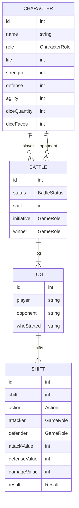

# API Dungeons & Dragons (AD&D)

API Rest usando Java SpringBoot com banco de dados Postgres.

O jogo, como todo bom RPG (Role Playing Game), será duelado em turnos.
Escolha o seu nome e personagem favorito (herói ou monstro).
O seu oponente sempre será um monstro, você pode escolher ou deixar aleatório.


## Arquitetura de tabelas



## Instruções

### 1 - Clonar o repositório

```bash
git clone https://github.com/Akaori/dungeons_and_dragons_api.git
```

### 2 - Subir o banco de dados
> Para subir o banco de dados Postgres, é necessário ter o docker e docker-compose instalados. 

Mudar para o diretório do repositório clonado:

```bash
cd dungeons_and_dragons_api
```


Rodar o seguinte comando:

```bash
docker-compose up
```

> Opcional: Após isso, é possível acessar o banco de dados Postgres (PGAdmin) no seguinte endereço (será necessário configurar o servidor):

http://localhost:89/

Credenciais:

- email: `admin@example.com`
- senha: `admin`


### 3 - Acessar o OpenAPI da API:

http://localhost:8080/swagger-ui/index.html

> Ao acessar a API, já é feita a inserção de alguns personagens de amostra. Para checar, é necessário ir no Swagger e testar a rota: `GET /api/v1/characters`


### 4 - Colocar credenciais para utilizar a API

Foi adicionada uma camada de seguranção (Basic Auth) para acessar a API. Utilizar as seguintes credenciais:

- Username: `user`
- Password: `user123`
