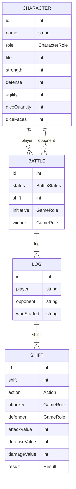
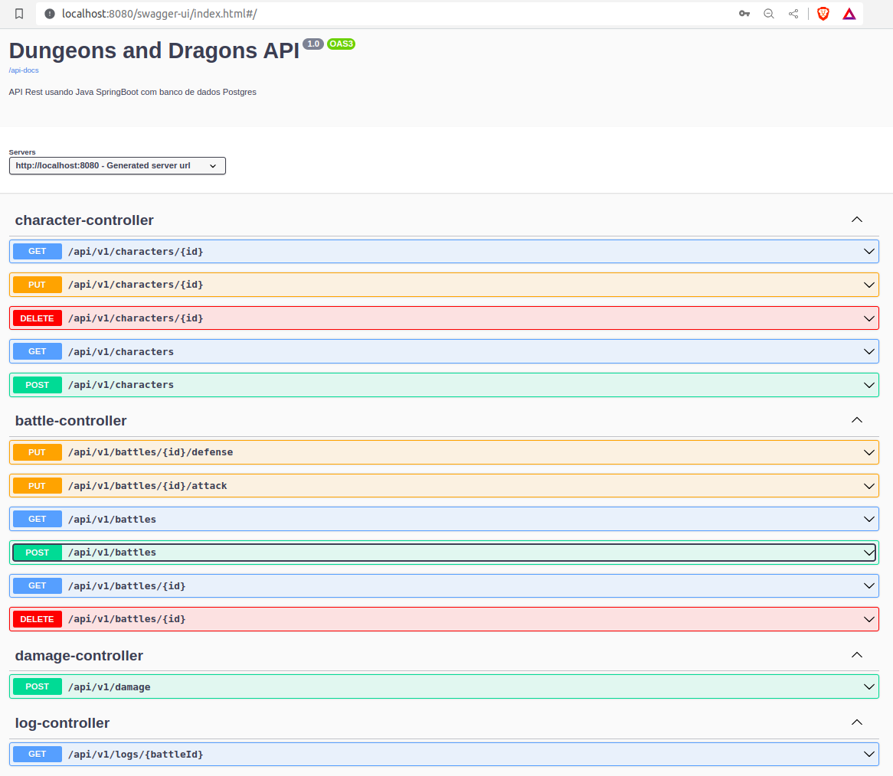
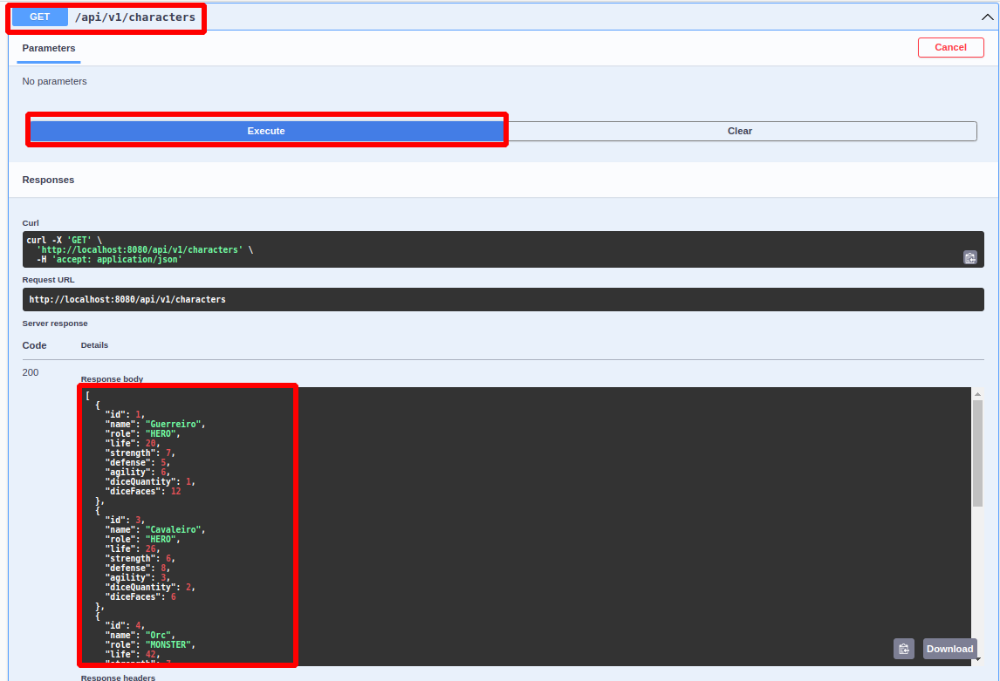
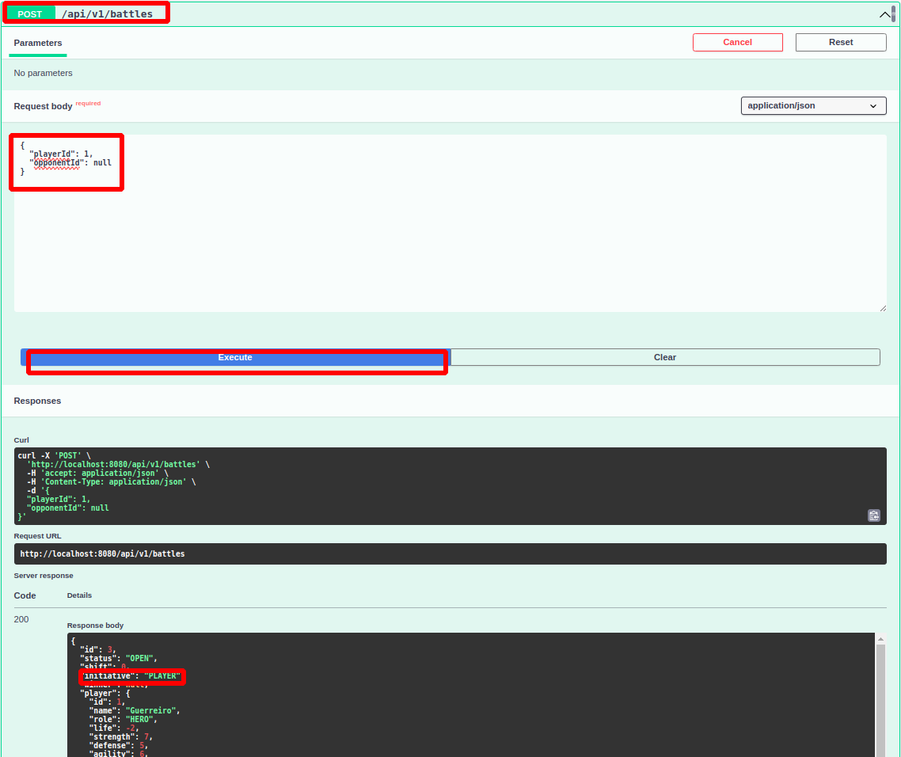
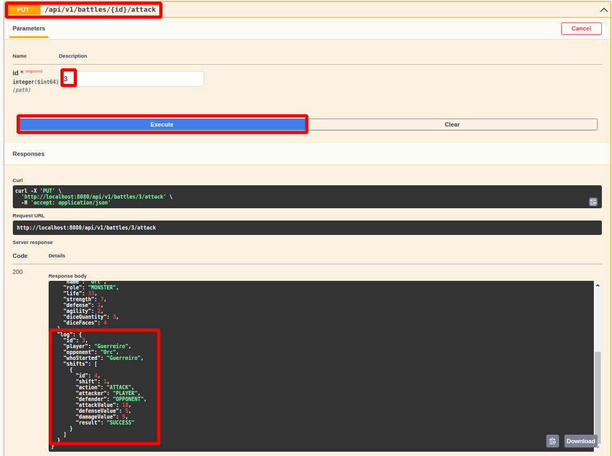
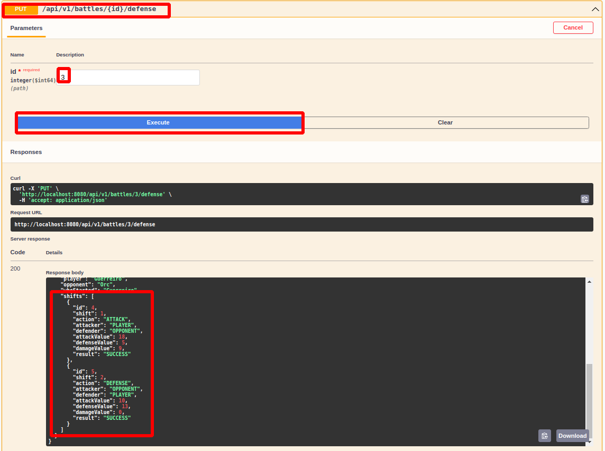
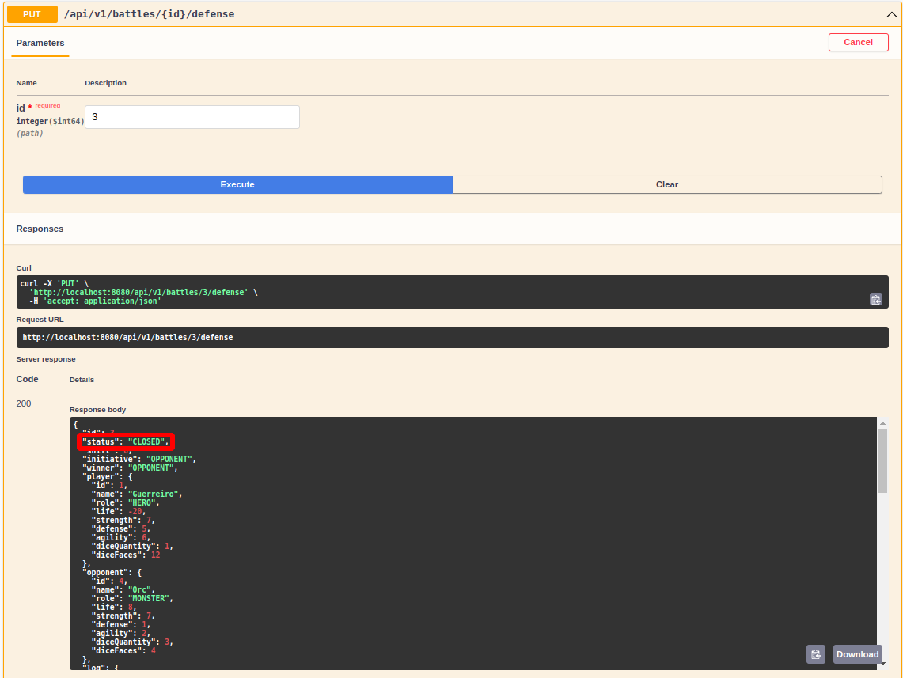
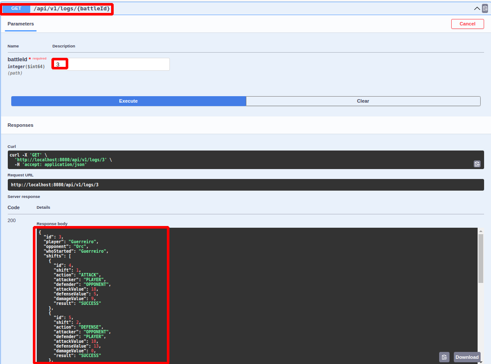

# API Dungeons & Dragons (AD&D)

API Rest usando Java SpringBoot com banco de dados Postgres.

O jogo, como todo bom RPG (Role Playing Game), será duelado em turnos.
Escolha o seu nome e personagem favorito (herói ou monstro).
O seu oponente sempre será um monstro, você pode escolher ou deixar aleatório.


[Clique aqui para ver o projeto](https://github.com/users/Akaori/projects/2/views/2)


## Arquitetura de tabelas



## Instruções

### 1 - Clonar o repositório

```bash
git clone https://github.com/Akaori/dungeons_and_dragons_api.git
```

### 2 - Subir os serviços (aplicativo springboot, postgres e pgadmin)
> É necessário ter o docker e docker-compose instalados. Para instalar no Ubuntu, seguir o seguinte tutorial: 
> https://www.digitalocean.com/community/tutorials/how-to-install-and-use-docker-compose-on-ubuntu-20-04-pt

Mudar para o diretório do repositório clonado:

```bash
cd dungeons_and_dragons_api
```


Rodar o seguinte comando:

```bash
docker-compose up
```

> Opcional: Após isso, é possível acessar o banco de dados Postgres (PGAdmin) no seguinte endereço (será necessário configurar o servidor):

http://localhost:89/

Credenciais:

- email: `admin@example.com`
- senha: `admin`


### 3 - Acessar o OpenAPI da API:

http://localhost:8080/swagger-ui/index.html

> Ao acessar a API, já é feita a inserção de alguns personagens de amostra. Para checar, é necessário ir no Swagger e testar a rota: `GET /api/v1/characters`



### 4 - Colocar credenciais para utilizar a API

Foi adicionada uma camada de seguranção (Basic Auth) para acessar a API. Utilizar as seguintes credenciais:

- Username: `user`
- Password: `user123`

### 5 - Instruções para usasr a API:

1. Listar os personagens existentes:



2. Iniciar uma batalha



- Escolher um `playerId` válido (que exista na listagem de personagens na etapa 1)
- O `opponentId` é opcional, se não for setado, o oponente será aleatório. Caso seja setado, escolher um id válido.
- Como resposta, é possível ver no atributo `initiative` quem começa a batalha. Na imagem acima, será o jogador.

3. Alter entre defesa e ataque, dependendo de quem for a iniciativa



- Como quem iniciou a batalha foi o jogador, a primeira ação será o ataque.
- Colocar qual é o id da batalha
- Como output, será possível ver os atributos dos personagens atualizados, o log e os turnos da batalha.



- Após o ataque, alternar para a defesa.
- Ir alternando entre ataque e defesa, até o status da batalhar ficar como `CLOSED`:



4. Ver o log



- O log contém detalhes de quem é o jogador, oponente e que começou.
- Também contém os turnos da batalha.
